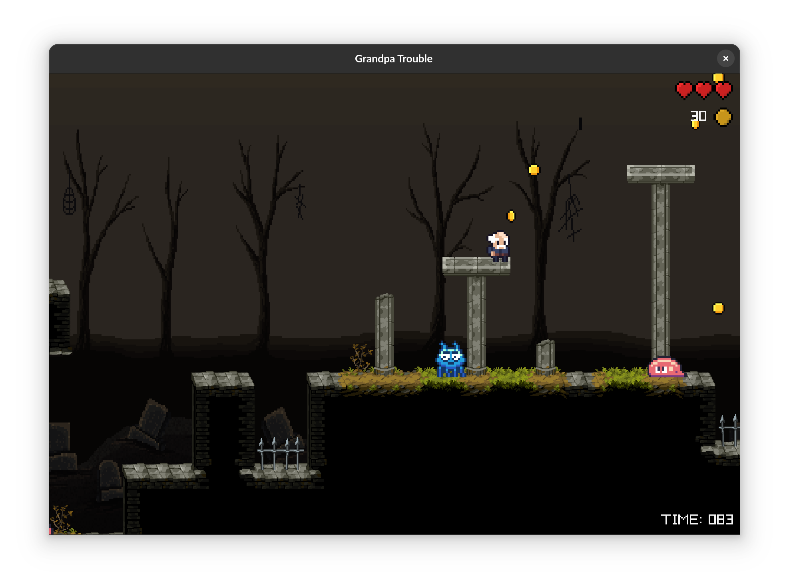

# Grandpa Trouble

> A 2D platformer where a rebellious old man escapes his retirement home, using his wit and stubbornness to overcome quirky enemies on his wild adventure.



Written in [zig](https://ziglang.org/) using [raylib](https://github.com/Not-Nik/raylib-zig) and an [ECS](https://github.com/prime31/zig-ecs).

## TODO

- [ ] Make velocity consistent for different frame rates.

## Playing the web version of the game

Head over to [itch.io](https://steflo.itch.io/grandpa-trouble) to play the game in your browser.

## Running the game

```sh
zig build run
```

## Building for the web

```sh
zig build -Dtarget=wasm32-emscripten
```

## Controls

| Key                | Description         |
| ------------------ | ------------------- |
| `H`, `Arrow Left`  | Move left           |
| `L`, `Arrow Right` | Move right          |
| `Space`            | Jump                |
| `Enter`            | Start/pause/resume  |
| `F1`               | Toggle debug mode   |
| `F2`               | Toggle sounds/music |
| `F3`               | Toggle camera zoom  |
| `Q`, `Escape`      | Quit game           |

## Assets

List of all assets used in this game:

| File                             | Source/Author                                                                                                                     |
| -------------------------------- | --------------------------------------------------------------------------------------------------------------------------------- |
| `player.atlas.png`               | [ULERINN: Old Man Character (modified)](https://ulerinn.itch.io/free-old-man)                                                     |
| `enemies.atlas.png`              | [ROTTING PIXELS: Enemy Character Pack ](https://rottingpixels.itch.io/enemy-characters-pack-free)                                 |
| `coin.atlas.png`                 | [OZU: Coin](https://osmanfrat.itch.io/coin)                                                                                       |
| `portal.atlas.png`               | [Pixelnauta: Pixel Dimensional Portal 32x32](https://pixelnauta.itch.io/pixel-dimensional-portal-32x32)                           |
| `ui/*.png`                       | [AR: RetroPixel Icons V1 (9x9)](https://opengameart.org/content/retropixel-icons-v1-9x9)                                          |
| `map/background_layer_*.png`     | [Free Pixel Art Fantasy 2D Battlegrounds](https://craftpix.net/freebies/free-pixel-art-fantasy-2d-battlegrounds/)                 |
| `map/tileset.png`                | [ANOKOLISA: Moon Graveyard Tileset](https://anokolisa.itch.io/moon-graveyard)                                                     |
| `map/map.tmj`, `map/tileset.tsj` | [stefanpartheym](https://github.com/stefanpartheym) with [Tiled Map Editor](https://www.mapeditor.org/)                           |
| `sounds/*.wav`                   | [stefanpartheym](https://github.com/stefanpartheym) with [rfxgen](https://raylibtech.itch.io/rfxgen)                              |
| `assets/soundtrack.wav`          | [stefanpartheym](https://github.com/stefanpartheym) in [Ardour](https://ardour.org/) with [OB-Xd](https://www.discodsp.com/obxd/) |
